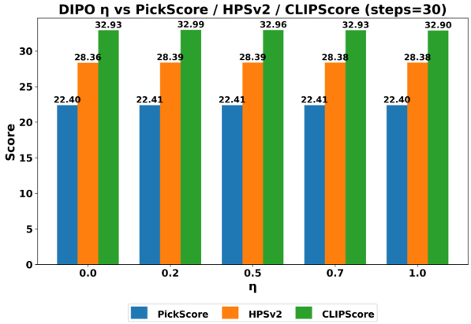

# Diffusion Implicit Policy Optimization (DIPO)

<p align="center">
  
</p> 
*Figure 1: Visual comparison between DIPO (30 steps, top) and Diffusion-DPO (800 steps, bottom) - From Paper Figure 3*

> **10-15× sampling acceleration** while preserving generation quality and human preference alignment  
✅ **No training objective modification** ✅ **Compatible with existing diffusion models** ✅ **Stochasticity control**

---

## 📌 Core Contributions
DIPO seamlessly integrates **DDIM accelerated sampling** into the Diffusion-DPO framework, with theoretical proof:

```math
L_{\text{DIPO}} = L_{\text{Diffusion-DPO}} + C \quad \text{(Gradient Invariance)}
```

### Key Advantages:

⚡ 10-15× Speedup: Matches 500-step Diffusion-DPO quality in 30-50 steps (Table 1,2)  
🎯 Preserved Preference Alignment: 59.9\% human preference win rate vs. base model (Figure 4)  
🧩 Plug-and-Play: Reuses Diffusion-DPO training pipelines and model weights  

---

## 🔧 Quick Start

### Environment Installation

Execute the following command:

```bash
conda create -n env python=3.10 -y
conda activate env
pip install -r requirements.txt
```

---

## 🛠️ Training Configuration

```yaml
base_model: "stabilityai/stable-diffusion-xl-1.0"
batch_size: 2048      # Effective distributed batch size
learning_rate: 8.192e-9
loss:
  dpo_coef: 5000      # β_{\text{DPO}} parameter
dataset: "Pick-a-Pic" # Human preference dataset
```

> **Note**: Training code is fully compatible with Diffusion-DPO - only sampler replacement needed  
> Just put the trained model path into the model path of the python file

---

## 📁 File Description
- **env**: Environment configuration
- **nateraw**: `parti-prompts` dataset  
- **hasty_sample.py**: Quickly sample and generate images and save them to the `generated_images` folder.  
- **Ablation_experiment.py**: Study the effect of the η parameter (randomness control) in DIPO sampling on generation quality. Generate PickScore/HPSv2 scoring tables and visualizations through 50-step sampling.  
- **Semantic_Categories.py**: Compare generation quality of 500 steps and 30 steps for three categories (portraits, landscapes, abstract art). Analyze success rate difference using visual grids and HPSv2 metrics.    
- **download_models.py**: Download the required evaluation model.

> Download the evaluation model locally and modify the path in the Python files.

---

## 📊 Experimental Results

### 1. Sampling Efficiency vs. Generation Quality

| Method        | Steps | PickScore | Time (s) | Speedup |
|---------------|-------|-----------|----------|---------|
| DIPO          | 20    | 22.0609   | 5.34     | 23.80×  |
| DIPO          | 50    | 22.3247   | 12.87    | 9.87×   |
| Diffusion-DPO | 500   | 22.6312   | 126.28   | 1.00×   |

*Table 1: DIPO achieves comparable quality to 500-step Diffusion-DPO in 50 steps (CLIPScore ≈0.663)*

---

### 2. Human Preference Alignment

  
*Figure 2: Fine-tuned model maintains preference advantage under DIPO sampling (59.9% win rate) - From Paper Figure 4*

---

### 3. Stochasticity Parameter (η) Analysis

  
*Figure 3: Minimal quality impact across η∈[0,1] (fluctuations <0.15%) - From Paper Figure 5*

---

### 4. Cross-Category Performance

| Category       | HPSv2 Win Rate | PickScore Win Rate |
|----------------|----------------|---------------------|
| Portrait       | 74.0% DIPO     | 50.5% DIPO          |
| Landscape      | 68.3% DIPO     | 54.0% DIPO          |
| Abstract Art   | 63.7% DIPO     | 51.2% DIPO          |

> DIPO maintains text-image consistency while DDPO excels in aesthetic preference

---

## 🙏 Acknowledgements

Codebase builds upon Diffusion-DPO. Evaluated using Pick-a-Pic dataset.
